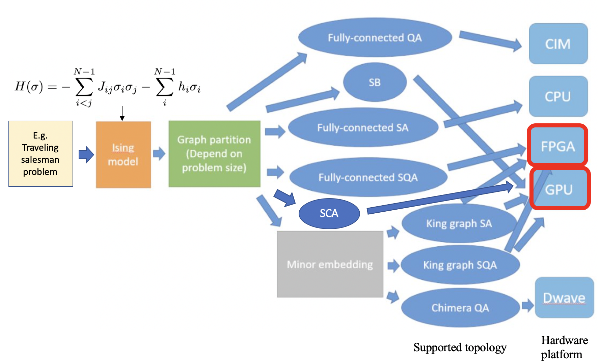

# Solving combinatorial problems

This project intends to provide a universal interface for solving combinatorial problems across multiple different platforms

.

## Ising Problem [[1]](#1).

The Hamiltonian of an Ising problem can be formulated as:

$$ H = -\sum_{i,j} J_{ij} s_i s_j - \sum_i h_i s_i $$

where $s_i \in \{-1, 1\}$ is the spin, $J_{ij}$ is the coupling strength between spin $s_i$ and $s_j$, and $h_i$ is the local field for $s_i.

The problem is to find $s_i$ minimizing $H.

## Methods

Different methods have been proposed, including SA [[2]](#2), SQA [[3]](#3), SCA [[4]](#4), SB [[5]](#5), NMFA [[6]](#6), and PT-SA [[7]](#7). 

Simulated Annealing (SA) is a classical method used to solve combinatorial problems. It does this by adjusting the temperature and making state changes probabilistically.
Simulated Quantum Annealing (SQA) simulates quantum annealing by introducing trotters. It can tunnel through tall and thin energy barriers to reach the global minimum.
Stochastic Cellular Automata (SCA) are cellular automata with stochastic updating rules. This means that the states of new entities are chosen based on probability distributions.
Simulated Bifurcation (SB) is a classical version of the quantum bifurcation machine. It exploits bifurcation phenomena and ergodic processes adiabatically.
Noisy Mean Field Annealing (NMFA) is an algorithm that mimics a coherent Ising machine (CIM), which is an optical system used to solve Ising problems.
Parallel Tempering Simulated Annealing (PT-SA) maintains multiple replicas of configurations at different temperatures. It swaps different replicas to achieve better solution quality.

In this project, we studied and implemented several quantum-inspired computations for solving the Ising problem. 
The implementations include CUDA codes for GPU and OpenCL codes for FPGA.

It's important to note the topology of the Ising problem. 
Since some hardware may not be able to handle a fully-connected graph (e.g., D-Wave chimera graph [[8]](#8)), minor-embedding [[9]](#9)) may be required to embed a fully-connected graph into a king graph before starting the annealing. 
Here, we also implement SA or SQA on king graph.

- There are READMEs under all the folders
- Current folder structure

```
Annealing
├── NMFA
│   └── CUDA_GPU
├── PT_SA_king
│   └── CUDA_GPU
├── SA_king
│   ├── CUDA_GPU
│   └── OpenCL_FPGA
├── SA_naive (fully-connected)
│   ├── CUDA_GPU
│   ├── OpenCL_FPGA
│   └── OpenCL_GPU
├── SB
│   └── CUDA_GPU
├── SCA (CUDA)
├── SQA_fully
│   ├── OpenCL_FPGA
│   ├── fully_test (CUDA)
│   └── improved_version (CUDA)
└── SQA_king
    ├── CUDA_GPU
    └── OpenCL_FPGA
```

# References

<a id="1">[1]</a> 
Ising model wikipedia: https://en.wikipedia.org/wiki/Ising_model

<a id="2">[2]</a> 
Nicholas Metropolis, Arianna W. Rosenbluth, Marshall N. Rosenbluth, Augusta H. Teller, Edward Teller; [Equation of State Calculations by Fast Computing Machines](https://pubs.aip.org/aip/jcp/article-abstract/21/6/1087/202680/Equation-of-State-Calculations-by-Fast-Computing?redirectedFrom=fulltext). J. Chem. Phys. 1 June 1953; 21 (6): 1087–1092.

<a id="3">[3]</a> 
Okuyama, Takuya, Masato Hayashi, and Masanao Yamaoka. "[An Ising computer based on simulated quantum annealing by path integral Monte Carlo method.](https://ieeexplore.ieee.org/abstract/document/8123652/?casa_token=BGNjplrAsbQAAAAA:oTOQiWXmxP7kxAuA_fRqqscXfmqqQUelEvnPo8WEcRU1AIMvaHqMCV4DHiMjKMchzTvYeyde)" 2017 IEEE international conference on rebooting computing (ICRC). IEEE, 2017.

<a id="4">[4]</a> 
Yamamoto, Kasho, et al. "[STATICA: A 512-spin 0.25 M-weight annealing processor with an all-spin-updates-at-once architecture for combinatorial optimization with complete spin–spin interactions.](https://ieeexplore.ieee.org/abstract/document/9222223?casa_token=Gh78uO4uu9UAAAAA:TKQigQQkk6gVcDYQdS9LDx-BDxf2yKBd06ZmIhX3f4f3D-yPJITQZlYaf1fKb-htRSvMa9II)" IEEE Journal of Solid-State Circuits 56.1 (2020): 165-178.

<a id="5">[5]</a> 
Goto, Hayato, Kosuke Tatsumura, and Alexander R. Dixon. "[Combinatorial optimization by simulating adiabatic bifurcations in nonlinear Hamiltonian systems.](https://www.science.org/doi/full/10.1126/sciadv.aav2372)" Science advances 5.4 (2019): eaav2372.

<a id="6">[6]</a> 
King, Andrew D., et al. "[Emulating the coherent Ising machine with a mean-field algorithm.](https://arxiv.org/pdf/1806.08422.pdf)" arXiv preprint arXiv:1806.08422 (2018).

<a id="7">[7]</a> 
Aramon, Maliheh, et al. "[Physics-inspired optimization for quadratic unconstrained problems using a digital annealer.](https://www.frontiersin.org/articles/10.3389/fphy.2019.00048/full)" Frontiers in Physics 7 (2019): 48.

<a id="8">[8]</a> 
D-Wave Chimera graph: https://docs.dwavesys.com/docs/latest/c_gs_4.html

<a id="9">[9]</a> 
D-Wave minor embedding: https://docs.ocean.dwavesys.com/en/stable/concepts/embedding.html
