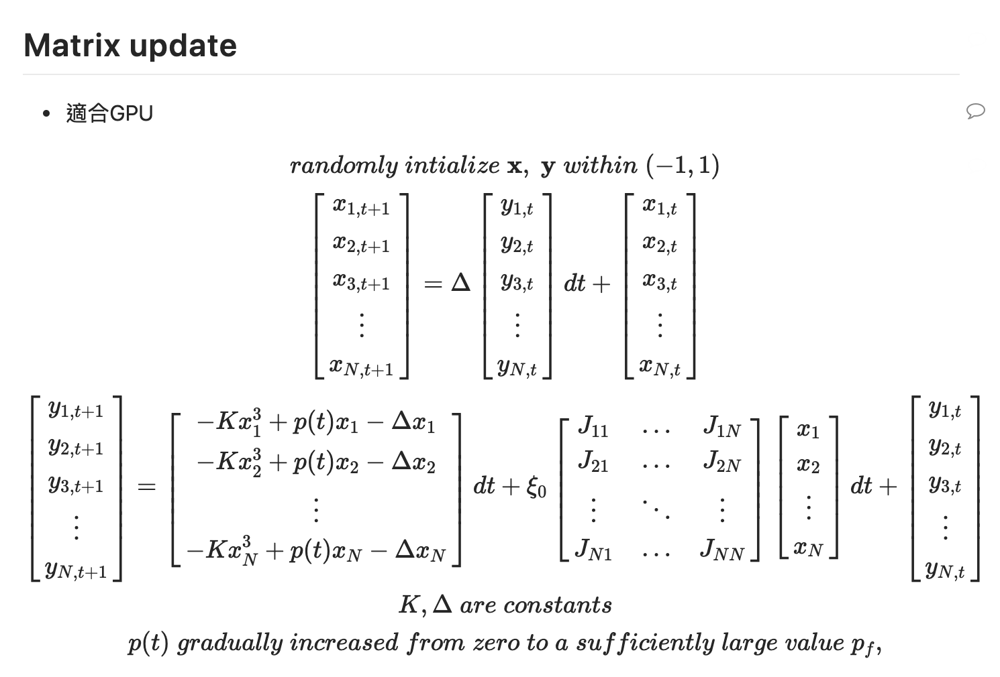

# CUDA SB

## TEST

- include nvcc library path

```
export PATH=/opt/cuda/bin${PATH:+:${PATH}}$
export LD_LIBRARY_PATH=/opt/cuda/lib64${LD_LIBRARY_PATH:+:${LD_LIBRARY_PATH}}
```

- test

```
git clone https://github.com/strongshih/Annealing.git
cd Annealing/SB/CUDA_GPU/
make
make test
```

## Update reference


