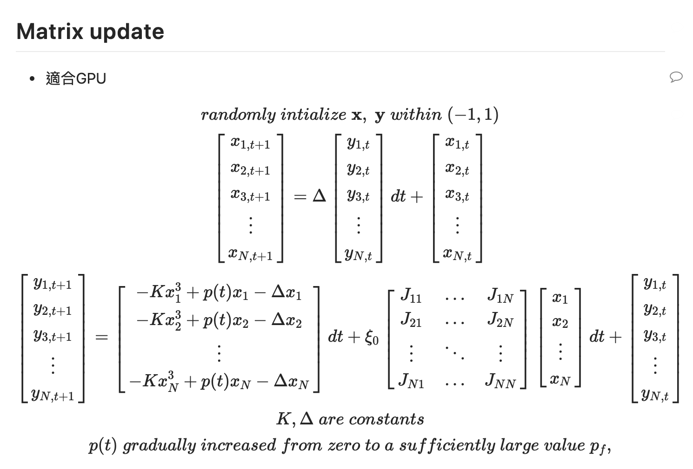
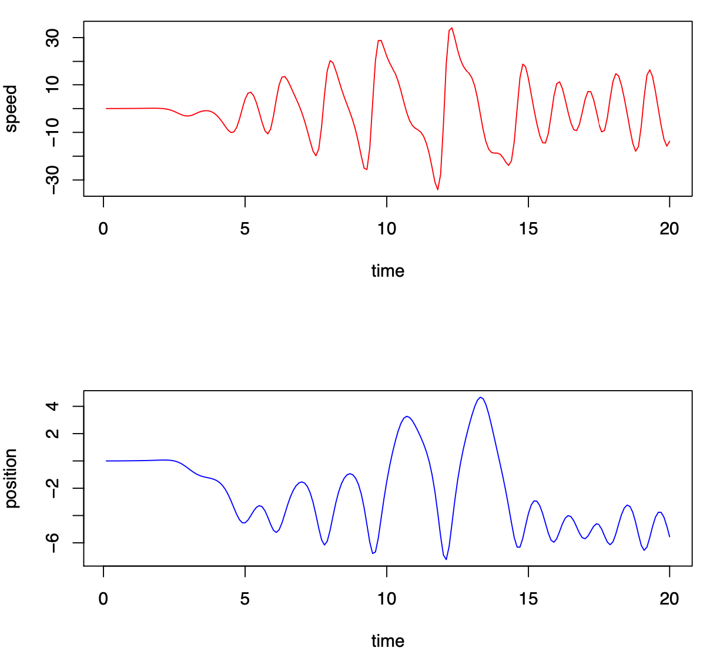

# CUDA SB

## File

```
python fully.py --> generate fully-connected problems, e.g: 0.txt
```

## TEST

- include nvcc library path

```
export PATH=/opt/cuda/bin${PATH:+:${PATH}}$
export LD_LIBRARY_PATH=/opt/cuda/lib64${LD_LIBRARY_PATH:+:${LD_LIBRARY_PATH}}
```

- test

```
git clone https://github.com/strongshih/Annealing.git
cd Annealing/SB/CUDA_GPU/
make
make test
```

## Update reference



## TODO

```
git clone https://github.com/strongshih/Annealing.git
cd Annealing/SB/CUDA_GPU/
* modify Bifurcation.cu
```

- At least energy results will be consistent with the results given by https://arxiv.org/abs/1401.1084
- Use `nvvp` or `nvprof` to further analyze the code, and optimize it
- Hopefully, the codes can achieve same experiment results as Toshiba SB's

## Update

- correctness 
- `stats.txt` shows the annealing time, which needs to be optimized
- plot speed and position


